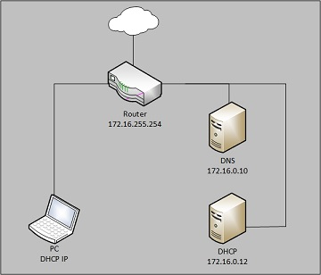

# First Test environment


## Network
### General build Information
* Set up a router, a client windows 10 PC, dhcp server and a dhcp server
* The servers and the PC all are in the same private network (172.16.0.0/16)
* 
### Router
* The router has an inside interface in the same network which acts as Default Gateway (172.16.255.254)
* The router has an outside interface which gets it's IP from an outside dhcp server
* The router has it's basic DNS set to the local DNS servers
* The router only forwards DNS requests if they are meant for the "Hogent.be" domain
* The router has NAT configured for the 172.16.0.0 network
### PC
* The PC is configured to get an IP address from a DHCP server
* The PC has windows 10 installed on it
### DNS server
* The DNS server only has the DHCP server and itself as possible translations
### DHCP
* The dhcp hands out IP's in the 172.16.0.0/16 network

## Tests
### First test
* I changed nothing to the configuration and the pc seems to only be able to reach the correct HoGent websites. It also gets a correct IP from the local dhcp and can still translate the dns and dhcp names.
### Second Test
* What happens when a user tries to put in his IP and DNS statically
 - Set the IP to 172.16.0.3 and the default gateway to 172.16.255.254. For the preferred DNS I used 8.8.8.8, the Alternate was set to 8.8.4.4.
* Access to the `hogent.be` domain stayed. But still no acces was given to other sites.
* When using `nslookup google.com 8.8.8.8` it gives the correct IP. But when surfing to that IP, you still can not connect to it.
* Why?


## Initial configurations
### Router
```
#!/bin/vbash
source /opt/vyatta/etc/functions/script-template

configure

# Fix for error "INIT: Id "TO" respawning too fast: disabled for 5 minutes"
delete system console device ttyS0

#
# Basic settings
#
set system host-name 'Router'
set system domain-name avalon.lan
#set service ssh port '22'

#
# IP settings
#
set interfaces ethernet eth0 address dhcp
set interfaces ethernet eth0 description WAN
set interfaces ethernet eth1 address 172.16.255.254/16
set interfaces ethernet eth1 description inside

#
# Static routing
#
# set protocols static route 172.16.0.0/17 next-hop 172.16.255.254 distance '1'
#
# Network Address Translation
#
set nat source rule 100 outbound-interface eth0
set nat source rule 100 translation address masquerade

#
# Time
#
delete system ntp
set system ntp server be.pool.ntp.org
set system ntp server be.pool.ntp.org prefer
set system time-zone Europe/Brussels
#
# Domain Name Service
#
set system name-server 172.16.0.10
set service dns forwarding system
set service dns forwarding domain hogent.be server 10.0.2.3
set service dns forwarding listen-on 'eth1'

# Make configuration changes persistent
commit
save

# Fix permissions on configuration
sudo chown -R root:vyattacfg /opt/vyatta/config/active

# vim: set ft=sh

```
### DNS (bertvv.BIND role and variables)
```
rhbase_firewall_allow_services:
  - dns
bind_zone_master_server_ip: 172.16.0.10

bind_zone_name: avalon.lan
bind_zone_networks:
  - '192.0.2'
  - '172.16.0'
bind_zone_name_servers:
  - dns
bind_zone_hosts	:
  - name: dns
    ip: 172.16.2.10
    aliases:
      - ns1
  - name: samba
    ip: 172.16.0.11
    aliases:
      - files
  - name: dhcp
    ip: 172.16.0.12
    aliases:
      - internal

bind_listen_ipv4:
  - any
bind_allow_query:
  - any
bind_forwarders:
  - '192.0.2.10'
```
### DHCP (bertvv.dhcp role and variables)
```
# host_vars/pu001.yml
# Variables visible to pr001
---
rhbase_firewall_allow_services:
  - dhcp

dhcp_global_authoritative: authoritative
dhcp_global_default_lease_time: 43200
dhcp_global_domain_name: avalon.lan
dhcp_global_routers: 172.16.255.254
dhcp_global_domain_name_servers:
  - 172.16.255.254
dhcp_global_classes:
  - name: vbox
    match: 'match if binary-to-ascii(16,8,":",substring(hardware, 1, 3)) = "8:0:27"'
  - name: reserved
    match: 'match if hardware = 1:00:11:22:33:44:55'

dhcp_subnets:
  - ip: 172.16.0.0
    netmask: 255.255.0.0
    pools:
      - range_begin: 172.16.0.2
        range_end: 172.16.127.254
      - range_begin: 172.16.128.1
        range_end: 172.16.191.254
        allow: 'members of "reserved"'
      - range_begin: 172.16.192.1
        range_end: 172.16.255.253
        allow: 'members of "vbox"'


dhcp_hosts:
  - name: werkstation1
    mac: '00:11:22:33:44:55'
    ip: 172.16.128.15

```
